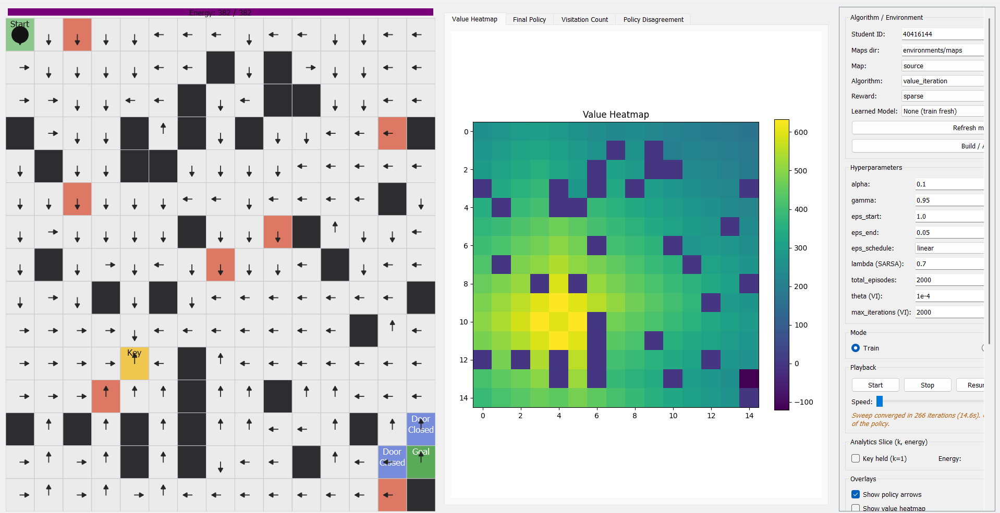

# GUI Guide — Dynamic Maze RL Project

This document explains how to use the interactive GUI (`gui/app.py`), what every
control does, and how it maps onto the real backend (`environments/`, `agents/`,
`experiments/`). It is meant to be moved into `gui/` once finalized (e.g.
`gui/gui_guide.md`), so all paths below are written relative to the project root.

The GUI is a **live visualization and demo tool**. It is not the source of the
project's reported numbers — those come from the batch CLI scripts
(`agents/value_iteration.py`, `agents/q_learning.py`, `agents/sarsa_lambda.py`,
`transfer/transfer_learning.py`) writing to `results/`. The GUI either drives a
fresh, live instance of one of these algorithms in real time, or replays a
previously completed batch run's saved policy.

Launch with:

```bash
python -m gui.app
```

<!-- fig: results/figures/gui/full_window_overview.png
     A full screenshot of the main window: maze animation pane (left),
     analytics tabs (right), and the full control sidebar (far right),
     mid-training on the source map with Q-Learning. -->

---

## 1. Layout at a glance

The window is split into three regions:

1. **Maze animation pane** (left) — the live `MazeCanvas`: the grid, the agent,
   the energy bar, and optional overlays (policy arrows / value heatmap /
   visited-path dots).
2. **Analytics panel** (middle) — a tabbed `AnalyticsPanel` with Matplotlib
   figures: Value Heatmap, Final Policy, Visitation Count (a fourth tab, Policy
   Disagreement, exists in the UI but is not wired up yet — see §6).
3. **Control sidebar** (right, scrollable) — every control required by the
   spec, grouped into boxes described below.

---

## 2. Algorithm / Environment group

This is where you choose *what* to build and load it into the session.

- **Student ID** — used only to double-check the loaded map's size matches
  `derive_seed_and_size(student_id)`. It does **not** regenerate the map; maps
  must already exist under the given maps directory (produced ahead of time by
  `environments/generate_maps.py`).
- **Maps dir** — folder containing the saved `source.json`,
  `transfer_similar.json`, `transfer_different.json`.
- **Map** — which of the three saved maps to load.
- **Algorithm** — `value_iteration`, `q_learning`, or `sarsa_lambda`. Changing
  this also refreshes the "Learned Model" dropdown (see below) and
  enables/disables the λ field (only relevant to SARSA).
- **Reward** — `sparse` or `shaped`. Affects the reward number shown in the
  live info panel and (for Value Iteration) the model it plans under. For
  Q-Learning/SARSA in live GUI mode this only changes *displayed* reward and
  the actual update targets, not the map or dynamics.
- **Learned Model** — a dropdown of previously completed **batch** runs found
  under `results/models/<algorithm>/`. Defaults to *"None (train fresh)"*.
  Picking a run here switches the whole Apply action into **import mode**
  (§4).
- **Refresh model list** — re-scans `results/models/<algorithm>/` (useful if a
  batch script finished in another terminal while the GUI is open).
- **Build / Apply** — commits the current selections and (re)builds the
  session. This is the one button that actually does something; changing
  dropdowns above it has no effect until you click Apply.

---

## 3. Hyperparameters group

Fields here are read at the moment you click **Build / Apply** — editing them
afterward does nothing until you re-apply (or Re-run, which rebuilds using
whatever is currently in these fields).

| Field | Used by |
|---|---|
| `alpha` | Q-Learning, SARSA(λ) |
| `gamma` | all three |
| `eps_start` / `eps_end` / `eps_schedule` | Q-Learning, SARSA(λ) |
| `lambda (SARSA)` | SARSA(λ) only (must be one of 0.0/0.3/0.7/0.9 per spec, though the GUI field itself doesn't enforce this — the CLI script does) |
| `total_episodes` | Q-Learning, SARSA(λ) — used only to compute the ε-decay curve's shape, not as a hard training cap in live mode (see §6) |
| `theta (VI)` / `max_iterations (VI)` | Value Iteration only |

If you selected a Learned Model instead of building fresh, these fields are
auto-populated from that run's saved `config.json` (see §4) so the sidebar
reflects the hyperparameters the model was actually trained with — but they're
then inert (a loaded model doesn't retrain from these values).

---

## 4. Two ways to "Apply"

### 4a. Train fresh
If "Learned Model" is left on *"None (train fresh)"*, Apply builds a brand-new
environment and a **zero-initialized** session (zero Q-table for Q-Learning/
SARSA, or an unconverged Value-Iteration session with no policy yet). Training
happens live, driven by the Playback controls (§5).

### 4b. Import a completed batch run
Selecting a run from "Learned Model" and clicking Apply instead:
1. Loads that run's `results/raw_data/<algorithm>/<run_id>/config.json` and
   populates the sidebar fields from it.
2. Rebuilds the environment using the loaded map/`max_energy`/reward version.
3. Loads the saved arrays from `results/models/<algorithm>/<run_id>/*.npy`
   (`Q.npy`, or `V.npy`/`policy.npy` for Value Iteration) and installs them
   into a fresh session, overwriting its zero-initialized arrays.
4. **Forces Eval mode and disables Train** — an imported model only replays
   the policy it was saved with; it does not continue learning in the GUI.
5. Turns on both the policy-arrow and value-heatmap overlays automatically.

If the saved array's shape doesn't match the rebuilt environment (e.g. the map
file changed since training, or `max_energy` is missing from `config.json`),
Apply fails with an explicit shape-mismatch dialog rather than silently
misaligning the state indices.

---

## 5. Mode and Playback

- **Mode: Train / Eval** — Train applies the live TD update every step (and
  uses the ε-greedy behavior policy with actual exploration). Eval sets
  ε = 0 and skips the update, so the agent follows its current greedy policy
  with no learning. For Value Iteration, this radio button has no effect on
  training (see §6) — it only matters for the greedy rollout once converged.
- **Start** — begins/resumes the timer loop. For Value Iteration specifically,
  the *first* Start click doesn't step the maze at all: it kicks off the full
  Bellman-sweep in a background thread (`vi_sweep_started` → status message →
  `vi_sweep_finished`), since a full sweep can take 15–20+ seconds at
  realistic `max_energy` and would otherwise freeze the window. Click Start
  again after convergence to watch a greedy rollout.
- **Stop** — pauses the timer; all state (Q-table, current episode, agent
  position) is preserved.
- **Resume** — identical to Start, kept as a separate button for clarity.
- **Reset** — resets only the *current episode* (agent back to the start
  cell, energy refilled). The learned Q-table/V/policy is **not** touched.
  Also clears the drawn path trace.
- **Re-run** — rebuilds a completely fresh session from the session factory
  (a brand-new zero-initialized Q-table / unconverged VI session), using
  whatever hyperparameters are currently in the sidebar. This is the "start
  the whole experiment over" button, as opposed to Reset's "restart just this
  episode."
- **Speed slider** — controls both how many environment steps happen per
  timer tick and the timer interval, so it affects both throughput and
  visual smoothness.

<!-- fig: results/figures/gui/playback_controls_detail.png
     Close-up of the Playback group mid-run, showing the status label
     during a Value Iteration background sweep. -->

---

## 6. Analytics Slice, Overlays, and unexpected/nonsensical results

The real V/Q/policy arrays are 4-D: `(x, y, k, energy)` for V/policy, plus an
action axis for Q. The GUI can only draw 2-D slices, so the **Analytics
Slice** group ("Key held" checkbox + "Energy" spinbox) picks which `(k,
energy)` cross-section every heatmap/arrow-field/overlay currently shows. This
is a *display* choice only — it does not change what the agent is doing.

The **Overlays** group toggles what's drawn directly on top of the maze
canvas itself: policy arrows, a red→green value heatmap tint, and small blue
dots marking every cell the agent has physically visited this session (the
"visited path" trace, cleared on Reset/Re-run).

### Why the heatmap and policy look completely different before vs. after the key

This is worth calling out explicitly, because looking at only *one* of these
two images in isolation is a common source of confusion — it can look like
two unrelated value functions, or even like evidence the maze is somehow two
separate problems stitched together. It is not: it is a single 4-D value
function `V(x, y, k, energy)` sliced at two different values of `k` via the
**"Key held"** checkbox in the Analytics Slice group.


Before obtaining the key (`k = 0`): value is highest near the key cell and
the policy arrows point toward it, since the key is the current sub-goal.



After obtaining the key (`k = 1`): the same region now shows a different
value gradient and different arrows, pointing toward the door/goal instead.

**Why this is still one MDP, not two.** `k` is part of the state tuple, not
an external mode switch — `transition_probabilities` and the reward
functions both take `k` as an input (e.g. the door is passable only when
`k == 1`, and the shaped reward's distance term targets the key when `k == 0`
and the goal when `k == 1`). Given `(x, y, k, energy)` and an action, the next
state's distribution is fully determined regardless of history — that's the
Markov property, and it holds here. What you're seeing with these two
screenshots is two 2-D *slices* of one 4-D array, `V[:, :, 0, e]` and
`V[:, :, 1, e]`, exactly the way slicing at two different `energy` values
would also produce visually distinct heatmaps. The visible "seam" at the
moment of pickup is exactly the evidence that `k` is doing its job of
preserving the Markov property — if `k` had been left out of the state
entirely, the value function would have had to blur together "already have
the key" and "still need it," which would genuinely break the Markov
property (the true next-state/reward distribution would then depend on
history the state doesn't encode).

Toggle **"Key held"** in the Analytics Slice group to reproduce either of the
two screenshots above yourself, on any algorithm — the same before/after
split shows up for Value Iteration's `V`/policy, and for Q-Learning/SARSA's
`max_a Q`/greedy policy, since all three share the same `(x, y, k, energy)`
state indexing (§6 continues below with other slice-related quirks).

A few results that look wrong at first glance but are expected, given how the
state space and the three algorithms differ:

- **Energy slice mismatches for imported models.** If you import a batch run
  trained with a different `max_energy` than the sidebar's default, the
  energy spinbox's maximum is reset to that run's value — but if you then
  switch maps or hyperparameters without re-applying, the currently-displayed
  slice can silently point at a stale index. Always re-Apply after changing
  the map or energy-related settings.
- **Value Iteration's heatmap/policy look mostly blank or arbitrary at low
  energy slices.** VI reasons over the *entire* nominal `(x, y, k, energy)`
  space, including energy values that are never reached by any real
  trajectory (energy only decreases monotonically from `max_energy` within an
  episode). At very low energy, most states are near-absorbing/unreachable
  in practice, so the greedy action shown there can look arbitrary — it's not
  wrong, it just was never a meaningfully "used" part of the value function.
- **Q-Learning/SARSA's Visitation Count tab is very sparse for high or very
  low energy slices**, for the same reason: energy always starts at
  `max_energy` and decays along a single trajectory, so only a thin,
  position-correlated band of `(position, energy)` combinations is ever
  actually visited. A near-empty visitation map at an extreme energy value is
  expected, not a bug — see `experiments/analysis.py`'s
  `reachable_states_mask` for the same observation applied to the batch-run
  comparison metrics.
- **Value Iteration's Visitation Count tab stays essentially empty/zero even
  after the sweep converges and you click Start again.** Visitation counting
  only increments on live environment steps (`_record_step`), and VI's "live"
  stepping is a single greedy rollout of the converged policy — a handful of
  steps along one path — not the thousands of exploratory episodes
  Q-Learning/SARSA accumulate. Don't expect it to resemble the other two
  algorithms' visitation maps.
- **The live info panel's "Epsilon" reads "—" for Value Iteration and for any
  imported model.** VI has no ε-greedy behavior policy at all, and imported
  models are forced into Eval mode (ε = 0, and the session doesn't expose a
  schedule the same way), so there is nothing meaningful to display there.
- **Changing `total_episodes` for a live (fresh) Q-Learning/SARSA session
  does not stop training at that count.** In the GUI, `total_episodes` only
  shapes the ε-decay curve (how quickly ε falls from `eps_start` toward
  `eps_end`); the live session has no episode cap and will keep running past
  it indefinitely at ε = `eps_end`. Only the batch CLI scripts
  (`--n-episodes`) actually terminate training at a fixed episode count.
- **A "Policy Disagreement" tab is visible in the Analytics panel but never
  updates, no matter what you do.** This comparison (learned policy vs. the
  Value Iteration reference) isn't wired into the GUI's refresh logic yet — it
  requires a second, already-converged VI run loaded alongside whichever
  algorithm you're currently viewing, which isn't implemented in this drop.
  Treat that tab as a placeholder for now.

---

## 7. Panels and Live Info

- **Panels group** — two checkboxes toggle whether the maze animation pane
  and/or the analytics panel are visible at all, for a bigger view of
  whichever one you care about.
- **Live Info group** — a read-only snapshot updated every step: episode,
  step count (within the current episode), cumulative episode reward,
  epsilon, whether the key is held, remaining energy, and the trailing
  success rate (mean over the last 50 completed episodes).

---

## 8. Export

- **Save maze frame…** — saves the current maze canvas (grid + agent +
  overlays, as currently drawn) to a PNG you choose.
- **Save all analytics figures…** — saves every analytics tab currently
  populated (Value Heatmap, Final Policy, Visitation Count) to PNGs in a
  chosen directory, named after each tab.

These exports capture whatever slice/overlay state is currently selected —
they are a snapshot of the live GUI, not a re-run of
`gui/render_outputs.py`'s batch figure generation (which reads directly from
`results/models/` and is the reproducible source for report figures).

---

## 9. Typical workflows

**Watch an algorithm learn from scratch:**
Algorithm/Environment group → pick map + algorithm, leave Learned Model as
"None" → set hyperparameters → Build/Apply → Mode: Train → Start. Adjust the
Analytics Slice to `k=0`/low energy early on (that's where the agent actually
is at first) and watch the Visitation Count tab fill in near the start cell.

**Inspect a finished batch run's policy:**
Algorithm/Environment group → pick the same algorithm and map the run was
trained on → choose it from "Learned Model" → Build/Apply (fields
auto-populate, Eval mode is forced) → Start to watch a greedy rollout, use the
Analytics Slice controls to look at the policy/value at different `(k,
energy)` combinations.

**Compare two ε-decay schedules live:**
Build/Apply with `eps_schedule = linear`, train for a while, note behavior;
Re-run with `eps_schedule = exponential` (same other hyperparameters) and
compare qualitatively. For the actual reported numbers, use the batch CLI
(`agents/q_learning.py --eps-schedule ...`) instead, per §0.
