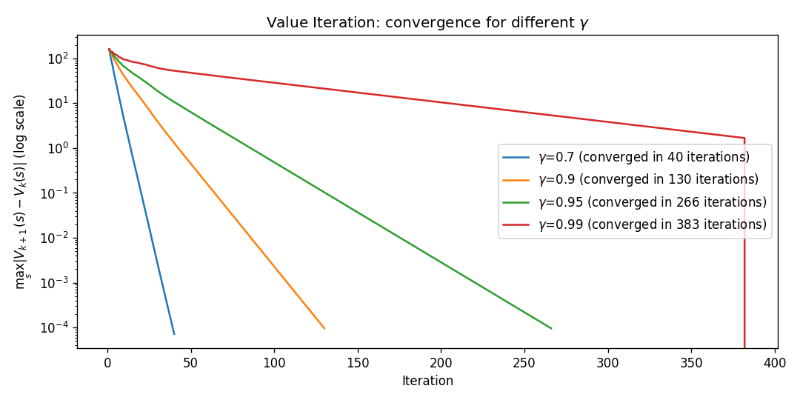
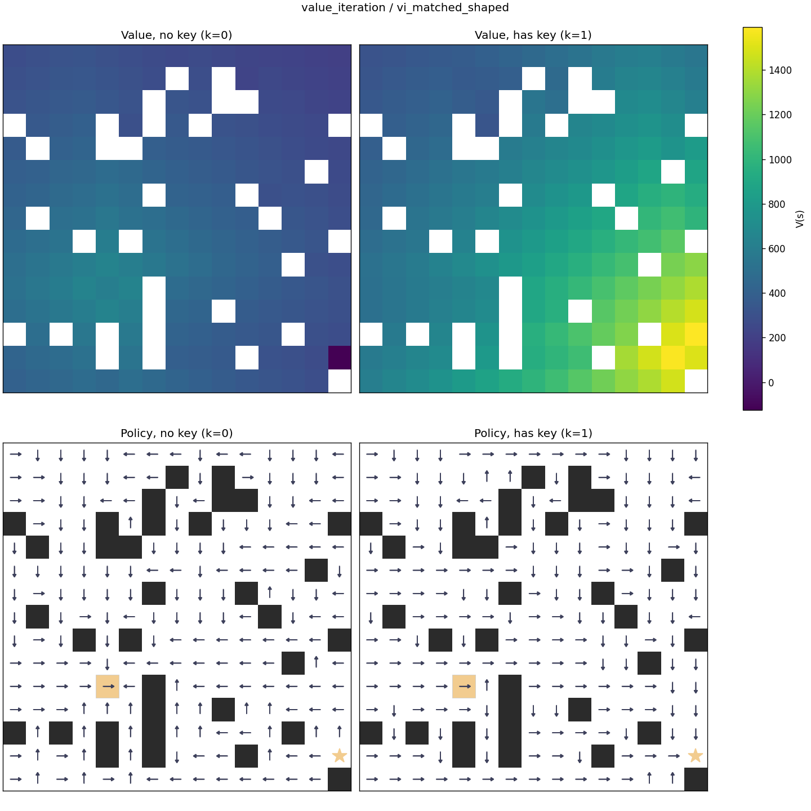
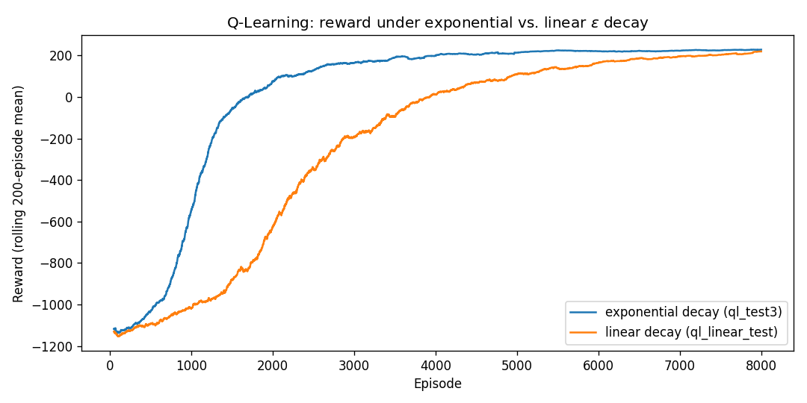
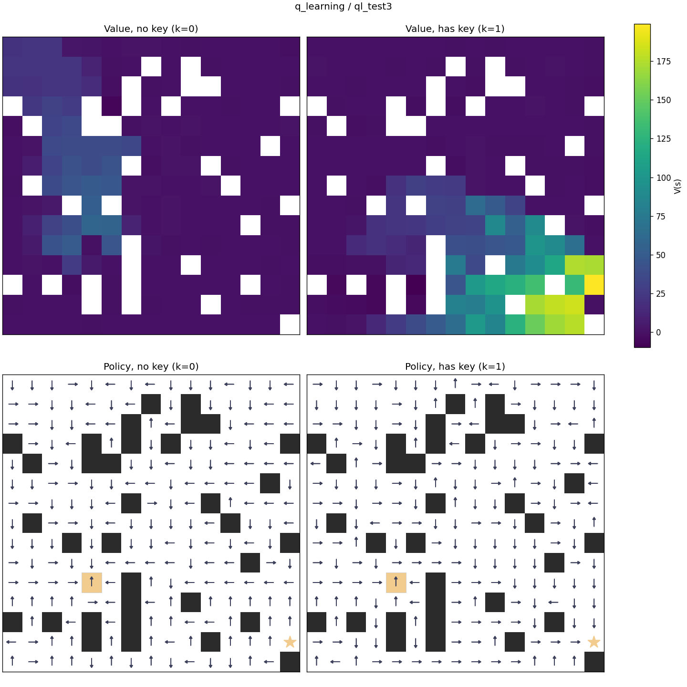
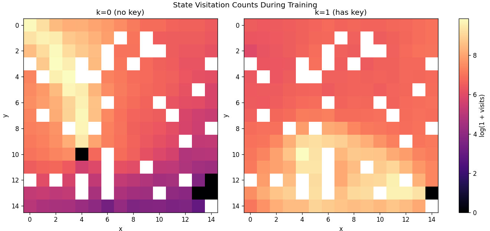
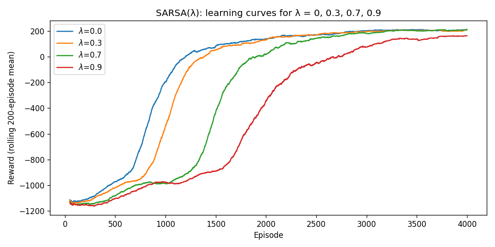
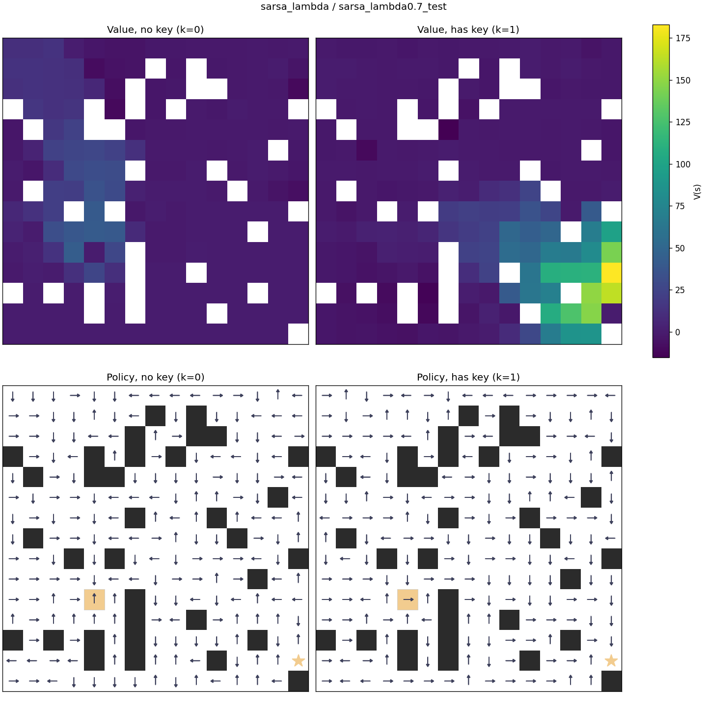
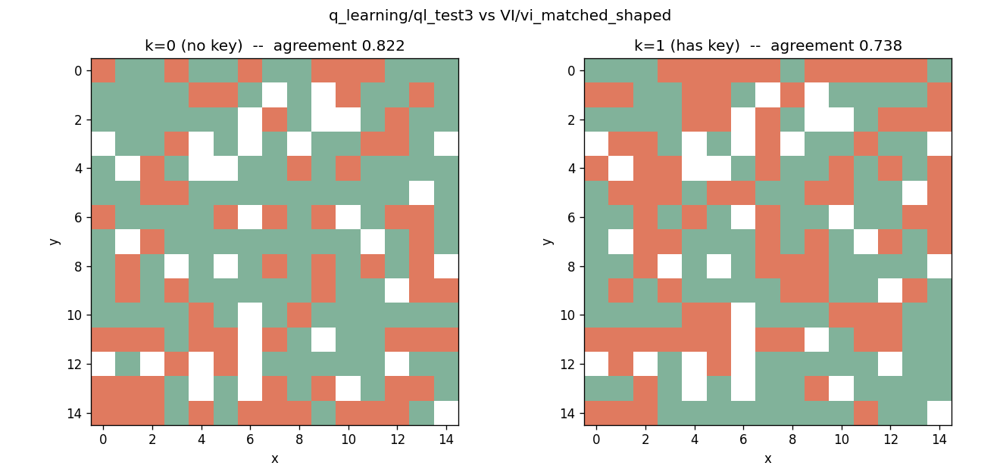
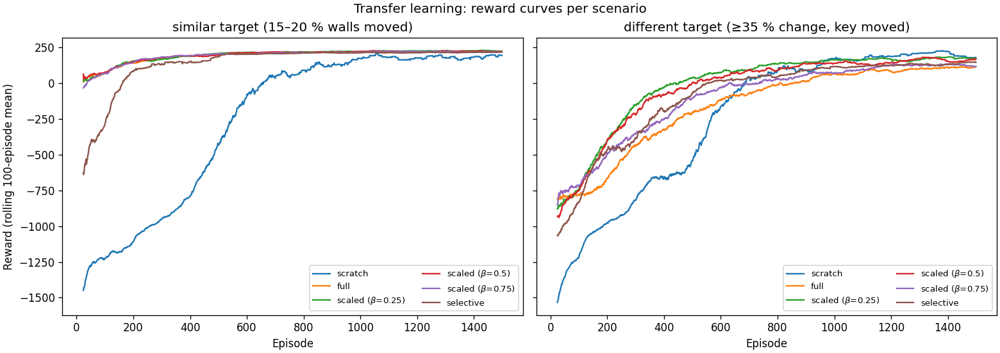
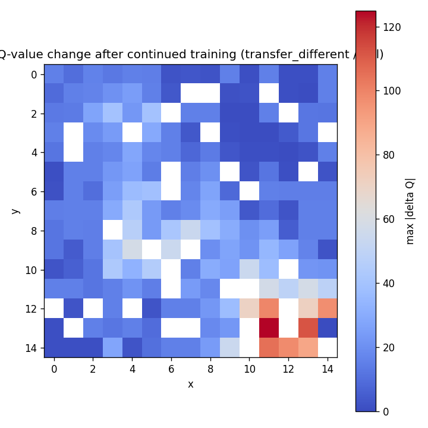

# Final Project Report — Design and Analysis of an Intelligent Agent in a Dynamic Maze

**Student ID:** 40416144 · **base seed:** 4 · **maze size:** 15 × 15 · **environment:** `source`

> This report covers the environment, the MDP formulation, the three
> algorithms (Value Iteration, Q-Learning, SARSA(λ)) with a full
> comparison, the transfer-learning section, and the answers to the
> analytical questions.
>
> Every chart in this report is generated from the persisted run data
> under `results/raw_data/` / `results/models/` (never retrained on the
> fly), and every figure is accompanied by the exact command that
> reproduces it. Only small, git-trackable artifacts are cited
> (`config.json`, `metrics.csv`, `condensed_events.log`,
> `visitation_counts.npy`); the multi-hundred-MB per-step `events.log`
> files are not referenced, because they are regenerated by each
> training run and are not tracked.

---

## 1. Introduction

This project connects reinforcement-learning theory to a working system:
a stochastic maze in which an agent must collect a key and then reach a
goal, with a limited energy resource and stochastic transition dynamics.
The environment is formalized as a Markov Decision Process (MDP), and
three algorithms are implemented from scratch and compared under
identical conditions:

1. **Value Iteration** — model-based; uses the full transition model.
2. **Q-Learning** — model-free, off-policy.
3. **SARSA(λ)** — model-free, on-policy, with eligibility traces.

The analysis demonstrates, with concrete numbers and charts, the
differences between model-based and model-free methods, the effect of
reward design, the exploration/exploitation trade-off, the role of
eligibility traces, and — in the separate transfer section — the limits
of knowledge transfer.

## 2. Project Summary

> Build a dynamic maze with a custom map, implement and compare three
> algorithms — Value Iteration, Q-Learning, and SARSA(λ) — run a limited
> transfer learning section on Q-Learning, and present results through a
> graphical interface, heatmaps, visual policies, statistical charts, and
> an analytical report.

This document covers the environment, the MDP formulation, the three
algorithms, the comparison, the transfer-learning section, and the
analytical questions.
## 3. Problem Definition and Maze Environment

### 3.1 The map

The map is generated from `student_id = "40416144"`:

```
base_seed = int(student_id[-2])  # 4
maze_size = 15 + (base_seed % 4) # 15
```

The shipped map is `environments/maps/source.json` and is regenerated,
byte-identically, with:

```
python -m environments.generate_maps --student-id 40416144
```

Cell inventory (verified against the map file):

| Cell type | Count | Requirement |
|---|---|---|
| Normal | 179 | — |
| Wall | 34 (15.1 %) | ≥ 15 % obstacles |
| Penalty | 7 | ≥ 5 penalty cells |
| Start | 1 (at (0,0)) | — |
| Key | 1 (at (4,10)) | — |
| Closed door | 2 (at (13,13), (14,12)) | guards the goal |
| Goal | 1 (at (14,13)) | — |

191 cells are traversable, giving `step_cap = 3 × 191 = 573` (recorded in
every `config.json`). The map was validated with a deterministic BFS
search (start → key → goal reachability) during generation; regeneration
is reproducible and the map file is the single environment used by all
algorithms.

### 3.2 Transition dynamics

At each step the agent chooses one of four actions (UP/DOWN/LEFT/RIGHT).
The chosen action is executed with probability **0.8**; with probability
**0.1** each the agent deviates to one of the two perpendicular
directions. Colliding with a wall keeps the agent in place and incurs a
penalty (in addition to the step cost). This stochasticity is reflected
in the transition model used by Value Iteration and is sampled in the
same way by the model-free learners (`environments/maze.py`,
`transition_probabilities` / `MazeEnv.step`).

### 3.3 State definition and the Markov property

A spatial-only state is *not* Markovian: whether the door opens depends
on whether the key was collected. The mandatory additional feature chosen
for this project is **limited energy**: the agent starts each episode
with `max_energy = 382` (twice the number of traversable cells) and
consumes 1 unit of energy per action, regardless of the outcome. When
energy reaches 0 the episode ends in failure.

The resulting minimal Markov state is therefore

```
s = (x, y, k, e)
```

where `k ∈ {0, 1}` is the key flag and `e ∈ {0, …, max_energy}` is the
remaining energy. Given `(x, y, k, e)` and the executed action, the next
state is fully determined by the map, the stochastic transition model,
and the known per-step energy decrement — no history is needed. The
energy variable is *not* cosmetic: it caps the number of steps an agent
can take and its consumption is part of every transition, so it is a
first-class component of the state and of the transition model.

### 3.4 Episode termination

An episode ends when any of the following occurs:

1. The agent reaches the goal (success);
2. Energy is depleted (failure);
3. The step count exceeds the cap (failure).

Over the full 8,000-episode Q-Learning training run, every one of the
8,000 episodes ended in one of these three ways: **7,147** reached the
goal and **853** ran out of energy; none hit the step cap (the cap is a
safety bound, not a binding constraint at convergence).

## 4. MDP Modeling and Reward Function

### 4.1 Formal MDP

- **State space** `S = {(x, y, k, e)}` with `0 ≤ x, y < 15`, `k ∈ {0, 1}`,
  `0 ≤ e ≤ 382`, restricted to non-wall positions.
- **Action space** `A = {UP, DOWN, LEFT, RIGHT}`.
- **Transition function** `P(s' | s, a)`: 0.8 for the intended move
  (0.6 when a perpendicular move hits a wall, in which case the wall
  collision outcome absorbs the remaining probability — see
  `transition_probabilities`), 0.1 for each perpendicular deviation, and
  zero for all other states. Energy always decreases by 1.
- **Reward function** `R(s, a, s')`: two versions, both with an exact
  event-based definition (see §4.2).
- **Discount factor** `γ = 0.95` for all algorithm runs (and analyzed at
  `γ ∈ {0.7, 0.9, 0.95, 0.99}` for Value Iteration).
- **Terminal states**: the goal cell (success), energy exhaustion, and
  step-cap exhaustion — all absorbing.
- **Policy**: `π(a | s)`, a (possibly stochastic) mapping from states to
  actions; learned as `V` / `Q` / `Q+E` by the three algorithms.

### 4.2 Two versions of the reward function

Both versions share the same sparse event base
(`environments/maze.py`, `SPARSE_REWARDS` / `SHAPED_REWARDS`):

| Event | Base reward (sparse) | Shaped total |
|---|---|---|
| Normal move | −1 | −1 (+ shaping below) |
| Wall collision | −5 (with step −1: −6) | −8 (extra `wasted_move_penalty −2`) |
| Door blocked | −5 (with step −1: −6) | same |
| Entering a penalty cell | −10 (with step −1: −11) | same |
| Key obtained | +50 (with step −1: +49) | same |
| Goal reached | +200 (with step −1: +199) | +201 |
| Energy depleted | −100 (with step −1: −101) | same |
| Step cap reached | −50 (with step −1: −51) | same |

**Version 1 — sparse.** A small per-step cost, large rewards only on
key/goal. This makes credit assignment hard: a positive signal arrives
only after 40–60 steps.

**Version 2 — reward shaping.** On top of the sparse base, the shaped
version adds (in `shaped_reward_fn`):

- `distance_shaping_scale = 2.0` per unit *reduction* in Manhattan
  distance to the current sub-goal (the key while `k=0`, the goal while
  `k=1`). This is potential-based in spirit (reward for progress, not
  absolute distance) and is skipped on the key step itself because the
  sub-goal switches at that transition;
- `safe_passage_bonus = 1.0` for a normal move that lands adjacent to a
  penalty cell without entering it;
- `wasted_move_penalty = −2.0` on wall collisions, to discourage
  repeated bumping.

**Did shaping merely speed training, or change the final policy?**
The two versions were compared with identical hyper-parameters
(`ql_test3`, shaped, vs `ql_sparse_test`, sparse; both α=0.2, γ=0.95,
ε 1.0→0.02 exponential, 8,000 episodes):

| Criterion | Shaped (`ql_test3`) | Sparse (`ql_sparse_test`) |
|---|---|---|
| Success rate, last 100 episodes | **100 %** | 50 % |
| Avg steps on success, last 100 | 56.9 | 289.7 |
| Avg wall collisions, last 100 | 2.8 | 23.8 |
| Avg penalty entries, last 100 | 0.44 | 2.36 |
| Avg reward, last 100 | **+226.3** | −333.2 |
| Per-position policy agreement vs shaped | — | **47.6 %** |

The shaped reward did far more than accelerate learning: it changed the
*final policy*. The two policies agree on only 47.6 % of positions, and
the sparse agent never converges (its last-100 success rate hovers around
50 %, with nearly 290 steps per success because it keeps wandering into
dead ends and penalty corridors). The shaping term did **not** introduce
the feared loop-exploitation behavior: the converged shaped policy walks
the goal path in ~57 steps and the wall-collision / penalty-entry counts
collapse to near zero, i.e. the agent is *not* farming the
`safe_passage_bonus` by pacing next to penalty cells.

### 4.3 Minimum loggable events

Every required event is logged per step and aggregated per episode into
the compact `condensed_events.log` artifact (see §8). Over the
`ql_test3` run the counts are:

| Logged event | Occurrences | Requirement |
|---|---|---|
| Normal move | 787,455 | ✓ |
| Wall collision | 124,935 | ✓ |
| Entering a penalty cell | 19,049 | ✓ |
| Obtaining the key | 7,730 | ✓ |
| Attempting a closed door | 48 | ✓ |
| Passing through the door | 12,564 | ✓ |
| Reaching the goal | 7,147 | ✓ |
| Episode ending (step cap / energy) | 853 | ✓ |

(Total steps 924,117.) The aggregation is produced by:

```
python -m experiments.condense_events --algorithm q_learning --run-id ql_test3
```

which turns the 129 MB `events.log` into a ~2.3 MB `condensed_events.log`
plus a 1.4 MB `visitation_counts.npy`, both tracked in git — every
analytical tool in this report reads those compact artifacts.

## 5. Technical Components Overview

```
Dynamic Maze Environment → [Value Iteration, Q-Learning, SARSA(λ)] → Evaluation & Ablation → Transfer Learning → GUI & Visual Analytics
```

- `environments/` — map generation + stochastic maze + reward functions.
- `agents/` — the three algorithms and the policy-extraction utilities.
- `experiments/` — comparison analytics, condensed-log tooling, and the
  Q-update reconstruction tool.
- `visualization/` — figure generation CLIs.
- `results/raw_data/<algo>/<run>/` — `config.json`, `metrics.csv`,
  `condensed_events.log`, `visitation_counts.npy` (RL runs).
- `results/models/<algo>/<run>/` — saved `Q.npy`, `V.npy`, `policy.npy`.

## 6. Algorithm 1: Value Iteration

### 6.1 Implementation

Value Iteration (`agents/value_iteration.py`) is implemented from scratch
with no RL library: the full transition model `P(s'|s,a)` and reward
function are built as a sparse-indexed tensor
(`build_sparse_transition_and_reward`), and each sweep applies

$$V_{k+1}(s) = \max_a \sum_{s'} P(s' \mid s, a)\left[R(s, a, s') + \gamma V_k(s')\right]$$

The convergence criterion is the maximum change in `V` between
consecutive sweeps; the run stops when `delta < theta = 1e-4`. Memory is
`O(X·Y·2·(E+1))` for the value table plus the sparse transition index.
After convergence the greedy policy is extracted as
`π(s) = argmax_a Σ P(s'|s,a)[R + γV(s')]`, giving the **reference policy**
for all comparisons.

**Reproduction:**

```
python -m agents.value_iteration --student-id 40416144 --map-name source \
  --gamma 0.95 --reward-version shaped --run-id vi_matched_shaped
```

### 6.2 Convergence

For the main run (`γ = 0.95`, `theta = 1e-4`) Value Iteration converged
in **266 iterations in 17.23 s**, with a final `max |ΔV| = 9.6e-5`
(`results/raw_data/value_iteration/vi_matched_shaped/config.json` and
`metrics.csv`). The per-iteration delta is saved for every run, which
allows the convergence analysis below.

### 6.3 Effect of the discount factor γ

The spec requires at least three γ values. Four runs were executed on the
identical map and reward (`theta = 1e-4`):

| γ | Run id | Iterations | Runtime (s) | Final delta |
|---|---|---|---|---|
| 0.7 | `vi_gamma0.7` | 40 | 3.63 | 7.2e-5 |
| 0.9 | `vi_gamma0.9` | 130 | 9.30 | 9.7e-5 |
| 0.95 | `vi_matched_shaped` | 266 | 17.23 | 9.6e-5 |
| 0.99 | `vi_gamma0.99` | 383 | 24.13 | 0.0 |



*Figure 1 — Per-iteration convergence delta (log scale) for the four γ
values.*

**Analysis.** Lower γ contracts the effective planning horizon, so values
decay rapidly and convergence is fast (40 sweeps at γ=0.7), but the
resulting policy is short-sighted: distant reward (the key at +50 and
especially the goal at +200) contributes little, and the discount
penalizes the multi-step detour through the maze. Higher γ keeps the
value signal from the goal alive across the whole corridor, so convergence
needs more sweeps (383 at γ=0.99) as information propagates one hop per
sweep — the classic contraction-rate trade-off (γ<1 is needed for
convergence; the Bellman operator is a γ-contraction). γ=0.95 is the
chosen operating point: it converges in a few hundred sweeps while the
reachable-state values still reflect the long key-then-goal horizon. The
policy at γ=0.95 is used as the comparison reference for the two
model-free learners.

### 6.4 Learned value and policy

The 2 × 2 figure below shows the VI value heatmap and greedy policy for
both key states (generated by the shared renderer, §8):



*Figure 2 — Value Iteration, γ=0.95: value heatmaps (top) and greedy
policy arrows (bottom) for k=0 (no key) and k=1 (has key). The value
field is smooth and high along the start→key→goal corridor; arrows point
consistently toward the sub-goal. The key cell (4,10) is highlighted.*

```
python -m visualization.render_outputs --map-name source --algorithm value_iteration --run-id vi_matched_shaped
```

The k=1 map shows the highest values concentrated in the door corridor
(right, around (13,13)/(14,12)) because the goal reward is now reachable,
while k=0 values are highest along the path to the key.

## 7. Algorithm 2: Q-Learning

### 7.1 Implementation

Q-Learning (`agents/q_learning.py`) is implemented as an **off-policy**
TD-control method. The behavior policy is ε-greedy with two implemented
and compared decay schedules:

```
exponential: ε(ep) = eps_end + (eps_start - eps_end) * exp(-ep / (n_episodes * k))
linear:      ε(ep) = eps_start + (eps_end - eps_start) * (ep / (n_episodes - 1))
```

The update rule (pure function `td_update`, also replayed for
verification in §7.5) is:

$$Q(s,a) \leftarrow Q(s,a) + \alpha\left[r + \gamma \max_{a'} Q(s',a') - Q(s,a)\right]$$

with the bootstrap term omitted at terminal states. Per-episode
`metrics.csv` records reward, steps, success, wall collisions, penalty
entries, and the ε used.

**Reproduction (exponential, shaped, the reference run):**

```
python -m agents.q_learning --student-id 40416144 --map-name source \
  --n-episodes 8000 --alpha 0.2 --gamma 0.95 \
  --eps-schedule exponential --eps-start 1.0 --eps-end 0.02 \
  --reward-version shaped --run-id ql_test3
```

### 7.2 Learning curve and ε-decay comparison

The two ε schedules were compared with otherwise identical parameters:



*Figure 3 — Smoothed per-episode reward for exponential vs linear ε
decay (rolling 200-episode mean).*

| Criterion | Exponential (`ql_test3`) | Linear (`ql_linear_test`) |
|---|---|---|
| First successful episode | 9 | 9 |
| Last-100 = 100 % success from episode | 1,403 | 3,201 |
| Total samples (steps) | 924,117 | 1,491,969 |
| Runtime | 57.1 s | 135.6 s |
| Success rate, last 100 | 100 % | 100 % |
| Avg steps on success, last 100 | 56.9 | 60.6 |
| Avg reward, last 100 | +226.3 | +219.0 |

**Analysis.** Both schedules reach 100 % success, but they differ
substantially in sample efficiency. The exponential schedule collapses ε
aggressively early (ε≈0.02 by ~3,000 episodes), so the agent
concentrates on exploiting its improving policy; the linear schedule
keeps exploration high for far longer (ε is still ~0.5 at episode 4,000),
which wastes ~1.6× the samples and roughly doubles the wall-clock time
for the same final quality. The reward curves diverge visibly from about
episode 2,000 onward: linear decay's persistent random actions keep
pulling the average reward down and slow the convergence of the last-100
success rate (episode 1,403 vs 3,201). The exploration/exploitation
trade-off is therefore resolved much more efficiently by exponential
decay on this maze, and exponential is used for the reference runs and
the transfer section.

### 7.3 Final policy and value figure



*Figure 4 — Q-Learning (`ql_test3`, γ=0.95): value heatmaps (top) and
greedy policy arrows (bottom) for k=0 / k=1. Each position uses the
energy level visited most during training (see §8). The learned policy
visibly mirrors the VI reference: from the start (0,0) it routes toward
the key (4,10), then after collecting the key it routes through the door
corridor (13,13)/(14,12) to the goal (14,13).*

```
python -m visualization.render_outputs --map-name source --algorithm q_learning --run-id ql_test3
```

### 7.4 Stability across runs

Run-to-run stability was measured with three independent seeds of the
same configuration (`ql_test3` seed 0, `ql_seed1` seed 1, `ql_seed2`
seed 2; 8,000 episodes each). Using `experiments.analysis.stability_across_runs`
the last-100-episode results are:

| Criterion | Mean ± std (3 seeds) |
|---|---|
| Reward (last 100) | 226.54 ± 1.13 |
| Success rate (last 100) | 1.00 ± 0.00 |
| Convergence episode (last-100 = 100 %) | 1,403 / 1,433 / 1,443 |

The policy is stable: all three seeds converge to a 100 % success policy
within ~1,400–1,450 episodes with reward variance under 0.5 %.

### 7.5 Manual reconstruction of a real Q-update

The spec requires at least one real Q-update to be selected from the log
and manually reconstructed. The tool `experiments/reconstruct_q_update.py`
replays the run's event log from episode 0 (Q starts at zero) and
reproduces the exact Q-table state that existed before the selected step,
then applies the update by hand. Selecting the goal step of the final
training episode (`--episode 7999 --step 57`):

```
python -m experiments.reconstruct_q_update --algorithm q_learning --run-id ql_test3 --episode 7999 --step 57 --verify
```

**Logged transition:** episode 7999, step 57
```
s  = (13, 13, 1, 325)     # one step before the goal, holding the key
a  = RIGHT (3)            # executed action
r  = +201.0               # goal reward + shaping (see §4.2)
s' = (14, 13, 1, 324)     # the goal cell
done = True               # terminal step, bootstrap omitted
```

**Reconstruction** (α = 0.2, γ = 0.95):
```
Q(s,a) before        = 186.462643
max_a' Q(s',a')      =  0.0      (terminal, no bootstrap)
r + γ·max Q(s')      = 201.0
TD error             = 201.0 − 186.462643 = 14.537357
Q(s,a) after         = 186.462643 + 0.2 × 14.537357 = 189.370115
```

The update is a small positive correction near convergence: the value of
"standing before the goal with the key" is already close to the goal
reward, and repeated episodes keep sharpening it toward ~201. Running the
tool with `--verify` replays the *entire* 924,117-step log from a zero
table and reproduces the saved `Q.npy` exactly (max absolute difference
**0.0**), which independently validates both the event logging and the
update arithmetic above. (A second example — the first-ever goal step in
episode 9 — is reconstructed by the same command with
`--episode 9 --step 243`, where `Q(s,a)` rises from 0 to 40.2 on the
first terminal reward the agent ever receives.)

### 7.6 Visitation map

The visitation-count map (per position, summed over energy) is a
required visual output and is produced directly from the compact
`visitation_counts.npy`:



*Figure 5 — Log-scaled visitation counts, k=0 (left) and k=1 (right).
k=0 visits concentrate along the start→key corridor; k=1 visits fan out
over the whole reachable area after the key is collected. The start cell
(0,0) and key cell (4,10) dominate because every episode resets there
and the key is collected in most episodes.*

```
python -m visualization.render_visitation --algorithm q_learning --run-id ql_test3
```

## 8. Algorithm 3: SARSA(λ)

### 8.1 Implementation

SARSA(λ) (`agents/sarsa_lambda.py`) is an **on-policy** method: the TD
target bootstraps from the value of the *action actually taken* next
(`Q(s', a')`), not the maximizing action:

$$\delta_t = r_{t+1} + \gamma Q(s_{t+1}, a_{t+1}) - Q(s_t, a_t), \qquad Q \leftarrow Q + \alpha \delta_t E$$

$$E_t(s,a) = \gamma \lambda E_{t-1}(s,a) + \mathbf{1}\{s = s_t,\ a = a_t\}$$

**Trace type.** *Replacing* traces are used (the trace of a revisited
state-action is set to 1 rather than incremented), because the maze lets
a stochastic agent revisit states within an episode (bouncing near a
wall, or an ineffective detour); accumulating traces would over-credit
such repeatedly-visited states. The trace is stored in a **sparse dict**
that decays by `γλ` each step and drops entries below a
`TRACE_MIN_THRESHOLD`, which is mathematically equivalent to the dense
formulation up to truncation but tractable for the large
`(X·Y·2·(E+1))` state space. When λ = 0 the decay is 0, the trace dict is
emptied each step, and the update reduces to one-step SARSA. Increasing λ
retains eligibility for previously visited state-actions, propagating the
TD error at step *t* backward along the whole episode.

### 8.2 Logging δ and E for one episode

For the last full episode of each run, `trace_detail.json` logs δ and
the eligibility-trace norm/max at every step. For the λ=0.7 run the last
episode has 50 steps, with δ ranging over [−32.9, +32.6] and the trace
norm over [1.0, 2.98]:

```
python -m agents.sarsa_lambda --student-id 40416144 --map-name source \
  --lam 0.7 --n-episodes 4000 --alpha 0.15 --gamma 0.95 \
  --eps-schedule exponential --reward-version shaped --run-id sarsa_lambda0.7_test
```

**Interpretation.** At the first step δ ≈ +1.06 (the shaped reward for a
productive move) and `E = {that state-action: 1.0}` — the trace norm is
exactly 1. On a later penalty-corridor step the agent produces a large
negative δ (e.g. −5.45 on step 1 and beyond, down to −32.9), which is
*spread back over the previously visited state-actions* whose traces are
still alive. The trace norm grows above 1 exactly when several distinct
state-actions have non-zero eligibility simultaneously (up to 2.98 here),
showing the credit-blame distribution in action: one big negative error
at a wall/penalty encounter retroactively lowers the Q-values of all the
states that led there.

### 8.3 Learning curves and the effect of λ



*Figure 6 — Smoothed per-episode reward for the four λ values
(rolling 200-episode mean).*

```
python -m visualization.plot_curves --kind sarsa_lambda
```

The four runs (4000 episodes, α=0.15, γ=0.95, ε exponential) were
condensed and compared:

| λ | Runtime (s) | Samples | Converges by episode | Steps on success (last 100) | Wall collisions (last 100) | Penalty entries (last 100) | Reward (last 100) |
|---|---|---|---|---|---|---|---|
| 0.0 | 46.9 | 582,108 | 1,002 | 62.1 | 4.46 | 0.74 | +208.4 |
| 0.3 | 56.5 | 634,829 | 1,040 | 61.1 | 4.41 | 0.70 | +208.1 |
| 0.7 | 76.5 | 796,176 | 1,986 | 63.6 | 3.84 | 0.52 | +212.3 |
| 0.9 | 111.1 | 996,369 | 2,727 | 92.0 | 6.37 | 0.75 | +165.9 |

**Which λ gives the best balance of learning speed and stability?**
λ = 0.3. It converges only ~4 % later than λ = 0 (episode 1,040 vs
1,002) and to the shortest final path (61.1 steps) with the same 100 %
success and almost identical reward (+208.1) — the eligibility trace gives
most of λ's credit-assignment benefit at negligible cost. λ = 0 (one-step
SARSA) is the fastest but stores no trace, so each error is applied to a
single state-action; λ = 0.7 already delays convergence to episode ~2,000
and λ = 0.9 to ~2,700, costs 1.5–2× the samples, and *degrades* the final
policy (92 steps, +166 reward): with a long episode the trace stays alive
over many irrelevant states, so a late error rewrites a long history of
unrelated earlier decisions, adding variance. The numeric evidence is
unambiguous: the reward curves (Fig. 6) show λ=0.3 tracking λ=0 nearly
throughout while λ=0.9 is both slower to rise and noisier at the top.

### 8.4 Final policy



*Figure 7 — SARSA(λ=0.7) final value heatmaps and policy arrows (same
layout as Fig. 2/4). The policy routes from start to key to door to goal,
visually matching the VI reference, but with visibly more irregular
values than VI (fewer states, especially low-energy ones, were updated
because SARSA explores on-policy and only the experienced states get
value).*

```
python -m visualization.render_outputs --map-name source --algorithm sarsa_lambda --run-id sarsa_lambda0.7_test
```

## 9. Comparing the Three Algorithms

### 9.1 Protocol

All three algorithms run on the same map (`source`), the same reward
version (shaped), and the same `max_energy = 382`, so the comparison is
fair by construction. The reference Q-Learning run is `ql_test3`
(8,000 episodes), the SARSA run is `sarsa_lambda0.7_test` (4,000
episodes), and the VI run is `vi_matched_shaped` (γ=0.95). The
comparison is computed by:

```
python -m experiments.compare_runs --map-name source \
  --vi-run-id vi_matched_shaped --q-learning-run-id ql_test3 \
  --sarsa-run-id sarsa_lambda0.7_test \
  --output-json results/raw_data/comparison_vi_ql_sarsa.json
```

### 9.2 Headline comparison

| Criterion | Value Iteration | Q-Learning | SARSA(λ=0.7) |
|---|---|---|---|
| Method type | Model-based | Model-free, off-policy | Model-free, on-policy |
| Unit of progress | Bellman sweep | Episode | Episode |
| Runtime | 17.2 s | 57.1 s | 76.5 s |
| Samples consumed | (model, none) | 924,117 | 796,176 |
| Memory (saved tables) | V+Q+policy 8.3 MB | Q 5.5 MB | Q 5.5 MB |
| Policy agreement with VI, reachable states | — | 48.8 % | 38.9 % |
| Policy agreement with VI, per-position | — | 82.2 % / 73.8 % (k=0/k=1) | — |
| Success rate (last 100) | 100 % | 100 % | 100 % |
| Avg steps on success | ~57 | 56.9 | 63.6 |
| Wall collisions / penalty entries (last 100) | — | 2.76 / 0.44 | 3.84 / 0.52 |

### 9.3 Policy agreement, color-coded



*Figure 8 — Positions where the Q-Learning greedy policy agrees (green)
or disagrees (red) with the VI reference, for k=0 (left, 82.2 % agree)
and k=1 (right, 73.8 % agree).*

```
python -m visualization.render_agreement --algorithm q_learning --run-id ql_test3
```

Two agreement numbers are reported deliberately:

- **Reachable-states agreement (48.8 %)** compares the full
  `(x, y, k, e)` state space restricted to states actually visited in
  training. It is a *state-weighted* measure, and because energy
  decreases monotonically and resets every episode, a single visited
  position maps to many `(x, y, k, e)` states whose VI actions can
  legitimately differ by energy.
- **Per-position agreement (82.2 % / 73.8 %)** compares one action per
  `(x, y, k)` position at the energy the agent most often experienced —
  the natural granularity of the policy figures in this report.

Both agree on the headline conclusion: the model-free policy matches VI
on the vast majority of *positions* and disagrees most where information
is missing or the value surface is flat.

### 9.4 Three example states where the model-free policy differs

The 152 per-position disagreements were collected into
`results/figures/q_learning/ql_test3/policy_agreement_details.json`.
Three representative states are analyzed with respect to the local
structure of the environment.

**Example 1 — the phantom door state `(13, 13, k=0)`, never visited.**

| | VI | Q-Learning |
|---|---|---|
| Action | LEFT (retreat) | UP (artifact) |
| Q(s,·) | [259.9, 243.8, 278.1, 117.4] | [0, 0, 0, 0] |

This is a door cell. Without the key (k=0) it cannot be entered, so it
was visited **0 times** in training and the QL row is all zeros; the
derived action `UP` is the meaningless `argmax` tie-break of an untrained
row, not a learned decision (see `agents/policy_extraction.py`). VI, which
has the model, knows the door is impassable and retreats LEFT (gap between
best and second-best of 18.1). The disagreement here is a *data*
artefact — no model-free algorithm can learn about a state it never
reaches.

**Example 2 — the start cell `(0, 0, k=0)`, visited 14,791 times.**

| | VI | Q-Learning |
|---|---|---|
| Action | RIGHT | DOWN |
| Q(s,·) | [262.5, 282.0, 262.5, 282.1] | [9.9, 20.8, 12.3, 17.4] |

Here VI itself is almost indifferent: RIGHT and DOWN differ by only 0.14.
From the start, both the rightward and downward first steps eventually
route toward the key, and under the 0.8/0.1/0.1 stochastic dynamics the
expected difference is tiny. QL's sampling noise (this is the most
replayed state in the maze) tips its argmax to DOWN. This is a
*flat-value* disagreement: neither choice meaningfully changes expected
return.

**Example 3 — the key cell `(4, 10, k=1)`, visited 19,422 times.**

| | VI | Q-Learning |
|---|---|---|
| Action | RIGHT (toward door) | UP |
| Q(s,·) | [637.4, 624.3, 588.7, 645.3] | [16.9, 6.7, 4.9, 5.0] |

After collecting the key the agent should head DOWN/RIGHT toward the door
corridor. VI prefers RIGHT (gap 7.8). QL prefers UP by a margin of 10.3,
a genuine — if small — learned difference at a heavily visited state. The
cause is systematic under-estimation: QL's absolute Q-values (~17) are
~30× smaller than VI's (~637), because during training the bootstrap
`max_a' Q(s',a')` frequently reads from energy rows of `s'` that have not
been updated yet (all-zero), deflating the target, and the finite-sample
estimates stay biased low. The *ordering* within the row is still mostly
correct, which is why the greedy policy remains near-optimal in path
quality (56.9 steps vs VI's ~57), but it is enough to flip this one
decision near the key.

### 9.5 Runtime, samples, memory, stability, sensitivity

- **Runtime.** VI (17.2 s) is the cheapest because it plans in sweeps
  over the whole state space without interacting with the environment.
  QL (57.1 s) and SARSA (76.5 s) must sample hundreds of thousands of
  steps; SARSA pays an additional per-step cost for trace decay.
- **Samples.** QL needs 924,117 samples for its 8,000 episodes; SARSA
  796,176. The model-free cost is dominated by exploration, which is why
  the ε schedule matters so much (§7.2).
- **Memory.** The saved Q-table is 5.5 MB (15·15·2·383·4 floats); VI's
  saved V+Q+policy is 8.3 MB. VI additionally held the sparse transition
  index during planning.
- **Stability.** QL is stable across seeds (reward 226.5±1.1, success
  1.00±0.00 over 3 seeds). SARSA(λ) is sensitive to λ (§8.3); λ=0.9
  degrades the final policy, which is exactly the hyper-parameter
  sensitivity the comparison section asks for.
- **Path quality.** All converged policies reach the goal in 100 % of
  the last 100 episodes. QL is the most direct (56.9 steps) and safest
  (2.76 wall collisions, 0.44 penalty entries); SARSA(λ=0.7) is slightly
  longer and slightly riskier (63.6 steps, 3.84/0.52). The differences
  are consistent with the agreement figures: QL's greedy policy is closer
  to the VI optimum than SARSA's on-policy-learned policy.

### 9.6 Why VI needs a model and the model-free methods do not

Value Iteration computes expectations exactly from `P(s'|s,a)` and
`R(s,a,s')`, so it can evaluate states it will never visit — including
impossible phantom states (Example 1) — and provably converges to the
optimal policy (contractive Bellman update). Its limitations are the need
for an accurate model (for this environment the stochastic 0.8/0.1/0.1
dynamics must be known precisely) and a full sweep over ~1.7×10^5 states
per iteration. Q-Learning and SARSA(λ) only need experience: they update
exactly the states that occur, use far less memory, and adapt to an
unknown environment. Their limitation is exactly the price of that
generality — they have *no* value for states they never see (Example 1),
they need many samples to separate near-equal actions (Example 2), and
their Q-values are biased low by bootstrapping from partially-trained
rows (Example 3). In this project the two views agree remarkably well on
the reachable corridor (82 % per-position agreement) and both recover the
VI path quality, which is the strongest possible evidence that the
environment was implemented consistently and the learning actually
worked.

### 9.7 On-policy vs off-policy near dangerous cells

Q-Learning's bootstrap uses `max_a' Q(s', a')` regardless of the behavior
policy: it learns the value of the *optimal* continuation, so its greedy
policy can be evaluated directly and tends to be optimal. SARSA's
bootstrap uses `Q(s', a')` for the action the behavior policy actually
takes: it learns the value of its *own* exploration policy. Near
dangerous cells this shows up concretely: both converged policies avoid
the penalty corridor (penalty entries drop to 0.44–0.52 per episode in
the last 100), but QL's off-policy updates let it learn a tighter, more
direct route (56.9 vs 63.6 steps) even though both still explore the same
way during training. SARSA's on-policy values remain inflated by its own
occasional risky exploration, which is also why its Q-values translate
into a slightly more conservative, longer policy.

## 10. Transfer Learning (Q-Learning)

### 10.1 Target environments

The source environment is the `source` map used by all previous sections,
trained with Q-Learning (`ql_test3`, 8,000 episodes, shaped reward). Two
target maps are derived from it by the map generator
(`python -m environments.generate_maps --student-id 40416144`):

- **`transfer_similar`** — 6 of the 34 walls moved (17.6 %, within the
  required 15–20 %), while the start `(0,0)`, key `(4,10)`, goal
  `(14,13)`, and all seven penalty cells stay fixed. Moved walls:
  `(6,3),(6,6),(6,11),(6,13),(9,11),(14,8)` removed;
  `(2,11),(5,0),(5,6),(8,4),(9,10),(12,10)` added.
- **`transfer_different`** — 14 of the 34 walls change (41.2 %, ≥ 35 %),
  the key moves from `(4,10)` to `(4,2)`, and four new penalty cells are
  added at `(2,4),(7,5),(9,10),(14,7)`.

Both maps were validated with the deterministic BFS reachability check
(start → key → goal) during generation. Every run below uses the same
`max_energy = 382`, `step_cap = 573`, and shaped reward as the source run,
so the Q-tables are shape-compatible and only their *values* transfer.

### 10.2 The four scenarios

All four scenarios start Q-Learning on the target map (1,500 episodes,
α=0.15, γ=0.95, ε exponential 0.5→0.02, seed 0) from a different initial
Q-table `Q_T^(0)`:

| Scenario | `Q_T^(0)(s,a)` |
|---|---|
| Scratch | `0` everywhere (the baseline) |
| Full | `Q_S(s,a)` — every entry copied unchanged |
| Scaled | `β · Q_S(s,a)` for `β ∈ {0.25, 0.50, 0.75}` |
| Selective | `Q_S(s,a)` only where the 4-neighborhood of `(x,y)` is wall-for-wall identical between source and target, else `0` |

The scaled scenario implements `Q_T^(0)(s,a) = β·Q_S(s,a)` verbatim; the
selective mask is built by comparing the wall/non-wall signature of each
cell and its four neighbours
(`transfer/transfer_learning.py`).

**Reproduction:**

```
python -m transfer.transfer_learning --student-id 40416144 \
  --source-map source --source-run-id ql_test3 \
  --n-episodes 1500 --alpha 0.15 --gamma 0.95 \
  --eps-schedule exponential --eps-start 0.5 --eps-end 0.02
```

### 10.3 Results: initial performance, learning speed, final performance



*Figure 9 — Smoothed per-episode reward (rolling 100-episode mean) for all
six scenarios on the similar target (left) and the different target
(right).*

```
python -m visualization.render_transfer --kind curves
```

**Similar target (`transfer_similar`):**

| Scenario | Initial success (ep 0–49) | Final success (last 100) | Converges by episode (rolling-95) | Samples | Steps on success (last 100) | Reward (last 100) |
|---|---|---|---|---|---|---|
| Scratch | 0 % | 98 % | 843 | 270,256 | 65.1 | +192.9 |
| Full | 100 % | 100 % | 99 | 99,732 | 58.0 | +220.3 |
| Scaled β=0.25 | 100 % | 100 % | 99 | 97,911 | 57.4 | +223.4 |
| Scaled β=0.5 | 98 % | 100 % | 99 | 98,962 | 58.4 | +220.2 |
| Scaled β=0.75 | 100 % | 100 % | 99 | 98,705 | 57.2 | +218.6 |
| Selective | 62 % | 100 % | 161 | 126,021 | 65.9 | +216.8 |

Every transfer variant reaches 100 % success almost immediately, while
scratch needs ~850 episodes — and the transferred runs need only ~100 k
samples instead of ~270 k (2.7× fewer). Full and all three scaled variants
also end with a *better* final policy than scratch (57–58 vs 65.1 steps,
+218 to +223 vs +192 reward): a clearly positive transfer. Selective is
the weakest of the four (62 % initial, converges at episode 161, final
path quality close to scratch), because only part of the source knowledge
survives the neighborhood filter, but it still beats scratch.

**Different target (`transfer_different`):**

| Scenario | Initial success (ep 0–49) | Final success (last 100) | Converges by episode (rolling-95) | Samples | Steps on success (last 100) | Reward (last 100) |
|---|---|---|---|---|---|---|
| Scratch | 0 % | 99 % | 803 | 260,054 | 67.6 | +177.5 |
| Full | 26 % | 100 % | 501 | 269,893 | 86.5 | +113.6 |
| Scaled β=0.25 | 24 % | 99 % | 295 | 179,584 | 68.8 | +173.2 |
| Scaled β=0.5 | 18 % | 100 % | 337 | 190,192 | 68.9 | +166.4 |
| Scaled β=0.75 | 34 % | 100 % | 468 | 236,227 | 92.6 | +116.7 |
| Selective | 6 % | 100 % | 461 | 228,962 | 86.0 | +144.3 |

Here the picture inverts. Initial performance is far below the similar
target: even *full* transfer starts at only 26 % success (the key moved,
so the whole k=0 sub-goal structure changed), and selective starts at 6 %.
Transfer still accelerates learning — full converges at episode 501 vs
803 for scratch, and scaled β=0.25 at 295 with 1.4× fewer samples — but
the *aggressive* transfers (full, β=0.75) end up with a **worse final
policy than scratch**: 86–93 steps and +113 to +117 reward vs 67.6 steps
and +177.5. The over-transferred, confident-but-wrong values survive the
1,500-episode budget, so the agent converges to 100 % success along a
longer, lower-reward path. Scaled β=0.25 is the sweet spot: it matches
scratch's final path quality (68.8 steps, +173.2) while converging 2.7×
faster. β=0.75 (92.6 steps) is worse than β=0.5 (68.9), showing the
transfer-intensity axis is not monotonic.

**Per-target summary** (the metrics the analytical question asks for
separately):

| Criterion | Similar target | Different target |
|---|---|---|
| Initial performance (best scenario) | 100 % (full, β=0.25, β=0.75) | 34 % (β=0.75) |
| Learning speed (best scenario) | episode 99 (full / all β) | episode 295 (β=0.25) |
| Final performance (best scenario) | 57.2 steps (β=0.75), +223.4 (β=0.25) | 68.8 steps, +173.2 (β=0.25) |
| Negative transfer | none observed (all variants ≥ scratch) | full & β=0.75 degrade final policy |

### 10.4 A concrete negative-transfer example

For the different target, the transferred initialization contains a
state where the source map's structure justified an action that the
target map made wrong. Consider `(11, 13, k=1, e=331)` under the **full**
transfer:

| | Before transfer (Q_initial) | After 1,500 episodes (Q_final) |
|---|---|---|
| Q(s, UP) | 138.1 | 101.2 |
| Q(s, DOWN) | 120.9 | 104.6 |
| Q(s, LEFT) | 139.0 | 97.2 |
| Q(s, RIGHT) | **171.4** | 101.4 |
| Greedy action | RIGHT | DOWN |

**The structural change:** `(11,13)` sits two cells west of the door
corridor. In the source map the cell directly to its east, `(12,13)`, is
open, so walking RIGHT toward the door/goal was correct and the transferred
Q-table values RIGHT highest (171.4). In the different target a wall was
placed at `(12,13)`, so the transferred policy's first move greedily walks
into a wall it never encountered during source training — a textbook
negative transfer: the Q-values are confident, but they encode the wrong
map.

**How training corrected it:** during continued training the agent hits
that new wall repeatedly; each collision penalizes RIGHT, and its value
falls from 171.4 to 101.4 while DOWN (104.6) becomes the argmax. The
greedy policy now detours around the new wall instead of walking into it.
The same pattern appears on the similar target at `(5,5,k=0,e=364)` (a
wall added at `(5,6)`): DOWN (41.7) drops to 20.6 during training and the
policy flips to LEFT — but there it was harmless because scratch never
beat the transferred path anyway.

Every run's `config.json` also records the `negative_transfer_example`
state auto-detected by `find_negative_transfer_example` — for the
different/full run it is `(5,10,k=0,e=364)`, whose transferred policy
greedily walks UP toward `(5,9)`, another newly added wall. That
particular energy row was never revisited in the 1,500 target episodes,
so its Q-values are unchanged in `Q_final`; the `(11,13,k=1,e=331)`
example above was chosen instead precisely because it also demonstrates
the correction, which the spec requires to be shown.



*Figure 10 — `max_{k,e,a} |Q_after − Q_before|` per position for the full
scenario on the different target. The hottest block (right half, x=10–14)
is the door corridor, whose transferred values were rewritten the most by
continued training — including the `(11,13)` example above (ΔQ=124.9), the
second-largest change in the whole map.*

```
python -m visualization.render_transfer --kind qdiff \
  --target transfer_different --scenario full
```

## 11. Answers to the Analytical Questions

### Q1. Complete MDP and why the state preserves the Markov property

The MDP is fully specified in §4.1 and §3.3: states
`S = {(x, y, k, e)}` with `x, y ∈ [0,15)`, `k ∈ {0,1}` the key flag and
`e ∈ {0,…,382}` the remaining energy; actions `A = {UP, DOWN, LEFT,
RIGHT}`; the transition `P(s'|s,a)` is 0.8/0.1/0.1 over the intended and
perpendicular moves (0.6 + wall absorption when a perpendicular move hits
a wall), with `e` always decremented by 1; rewards are the exact
event-based table of §4.2; `γ = 0.95`; terminal states are the goal,
energy exhaustion, and step-cap exhaustion.

The state is Markovian because every variable that affects the future is
in it: `k` is required (the door at `(13,13)/(14,12)` only opens after the
key — a spatial-only state cannot predict the door's behaviour), and `e`
is required because the episode ends at `e=0` and the remaining budget
changes the value of every continuation. Given `(x,y,k,e)` and the
executed action, the next state is fully determined by the map and the
known stochastic dynamics — no episode history is needed.

### Q2. On-policy vs off-policy near dangerous cells

Q-Learning's bootstrap is `max_{a'} Q(s', a')` regardless of the action
the behaviour policy takes, so it learns the value of the *optimal*
continuation (§9.7). SARSA's bootstrap is `Q(s', a')` for the action
actually taken, so it learns the value of its *own* exploration policy.
Near the penalty corridor this shows up in the actual runs: both
converged policies avoid the penalty cells (entries drop to 0.44–0.52 per
episode in the last 100), but QL's off-policy values let it learn a
tighter route (56.9 vs 63.6 steps, §9.7), while SARSA's on-policy values
remain inflated by its own occasional risky exploration and translate into
a slightly more conservative, longer policy. The concrete per-step
difference is visible in the traces of §8.2: SARSA propagates a big
negative δ at a wall/penalty encounter back along the eligibility trace,
which QL would have applied to the *maximizing* action instead.

### Q3. Why VI needs a transition model; advantages and limitations

VI computes Bellman expectations exactly from `P(s'|s,a)` and
`R(s,a,s')`, so it needs a complete model of the environment and can
evaluate states it will never visit — including impossible ones (the
phantom door state `(13,13,k=0)` of §9.4, visited 0 times in training,
still gets a correct VI value). Its price is the model itself (here the
exact 0.8/0.1/0.1 dynamics must be known) and a full sweep over ~1.7×10^5
states per iteration (266 sweeps, 17 s). QL/SARSA need only experience,
update exactly the states that occur, and adapt to an unknown
environment, but have no value for unseen states (Example 1), need many
samples to separate near-equal actions (Example 2), and carry a
low-bias from bootstrapping partially-trained rows (Example 3). In this
project the two views agree on 82 % of positions and recover the same path
quality, so the environment was implemented consistently.

### Q4. Which λ gives the best balance of learning speed and stability?

λ = 0.3 (§8.3). It converges only ~4 % later than one-step SARSA
(episode 1,040 vs 1,002) and to the shortest final path (61.1 steps) with
the same 100 % success and nearly identical reward (+208.1). λ = 0.9 is
slower (converges at episode 2,727), costs ~1.7× the samples, and
*degrades* the final policy (92 steps, +165.9): with long episodes the
trace stays alive over many irrelevant states, so a late error rewrites a
long history of unrelated decisions. Numeric evidence: the four-row table
in §8.3 and Figure 6.

### Q5. Three states where the model-free policy differs from VI

Analyzed in §9.4 with the local structure of the map:

1. **`(13,13,k=0)` — a never-visited phantom state.** A door cell the
   agent cannot enter without the key; visited 0 times, so QL's row is
   all zeros and its derived action is a meaningless argmax tie-break,
   while VI retreats LEFT. The disagreement is a data artefact, not a
   learned decision.
2. **`(0,0,k=0)` — the start cell, visited 14,791 times.** VI itself is
   nearly indifferent between RIGHT and DOWN (gap 0.14) because both
   first steps route toward the key; QL's sampling noise tips its argmax
   to DOWN. A flat-value tie, harmless to path quality.
3. **`(4,10,k=1)` — the key cell, visited 19,422 times.** VI prefers
   RIGHT toward the door; QL prefers UP. QL's absolute Q-values (~17) are
   ~30× smaller than VI's (~637) because bootstrap targets read from
   partially-trained energy rows; the within-row ordering is mostly
   right, but the bias flips this decision. Systematic Q under-estimation.

### Q6. Transfer: similar vs different targets

Answered in §10.3 with initial performance, learning speed, and final
performance separated per target, plus the §10.4 negative-transfer
example. On the **similar** target every transfer variant is positive:
100 % initial success (vs 0 % scratch), ~2.7× fewer samples, and a final
policy slightly better than scratch. On the **different** target transfer
is *mixed*: it always speeds learning (converges at 295–501 vs 803 for
scratch) but aggressive transfers (full, β=0.75) end with a worse final
policy than scratch (86–93 vs 67.6 steps), while β=0.25 matches scratch
quality with 2.7× fewer samples — the clearest empirical statement of
*when transfer helps and when it hurts*.

## 12. Summary

All three algorithms were implemented from scratch, run on the same
map/reward/energy configuration, and validated against each other. VI
provides the optimal reference (266 sweeps, 17 s); QL with exponential ε
decay and shaped reward converges to a 100 %-success, near-optimal
policy in ~1,400 episodes with stable, reproducible results; SARSA(λ) is
best at λ=0.3, where traces give the credit-assignment speedup with none
of the instability that λ=0.9 shows. The reward analysis shows shaping
changed the final policy (47.6 % agreement with sparse) as well as
accelerating learning, and three concrete disagreement states show where
model-free learning can differ from the model-based optimum — never
visited states, flat-value ties, and systematic Q under-estimation. The
transfer section shows that transferred knowledge helps most when the
target is structurally close to the source (2.7× fewer samples, equal or
better final policy) and can actively hurt when the map changes
aggressively (full transfer on the different target ends 30 % worse than
scratch), with a concrete corrected negative-transfer example in §10.4.

---

*Figures 1–10 were all produced by the commands listed beside them; raw
metrics, per-run `config.json`, and the compact condensed logs are in
`results/raw_data/`, and model arrays are in `results/models/`.*
